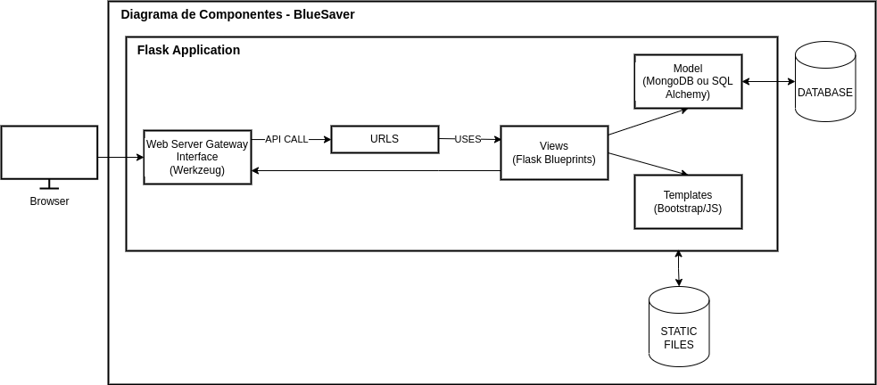

# BlueSaver
Projeto de MC426.  
Desenvolvido em Flask com apresentação das funcionalidades em um Swagger.

## Antes de tudo, vamos instalar as dependências:

``` pip install -r requirements.txt ```


## Para rodar o servidor FLASK, pode utilizar:
### I - Bash com seleção:
```bash
bash run.sh
```
### OU

### II - Flask run:
```bash
python3 -m flask --app app run
```

## Para visualizar as rotas, acesse:
```
localhost:5000
```

## Architectural Design e Design Pattern
### Diagrama a nivel de componentes

### Estilo Arquitetural
O estilo adotado foi o **MVT** (Model-View-Template), que é uma variação do MVC, adaptada quase que exclusivamente para o Flask, por conta dele não ter uma divisão exatamente definida na parte do view/controller.

### Componentes e suas responsabilidades
* Model: É responsável pela estrutura de dados da aplicação, contendo as regras de negócio para leitura/escrita no BD.
* View: É responsável por lidar com a interação com a aplicação, recebendo as requisições do cliente e respondendo com o template adequado.
* Template: É responsável pelo retorno de dados para o usuário, podendo ser uma representação visual do dado, como um HTML ou bruto como um json ou um arquivo binário.
* WSGI: É responsável pela comunicação por lidar com a conexão da rede, recebendo e enviando respostas.

### Design Pattern adotado
Para a parte de "models"/dados, resolvemos adotar o modelo de padrão de projeto “Factory method”, para que possamos acessar os dados de maneira simples, estejam eles armazenados localmente ou em um banco de dados. Banco de dados esse que poderia ser ainda mais especificado no padrão, criando por exemplo, uma classe para BD's SQL e outro NoSQL.

> Hannah Ritchie and Max Roser (2017) - "Water Use and Stress". Published online at OurWorldInData.org. Retrieved from: 'https://ourworldindata.org/water-use-stress' [Online Resource]

